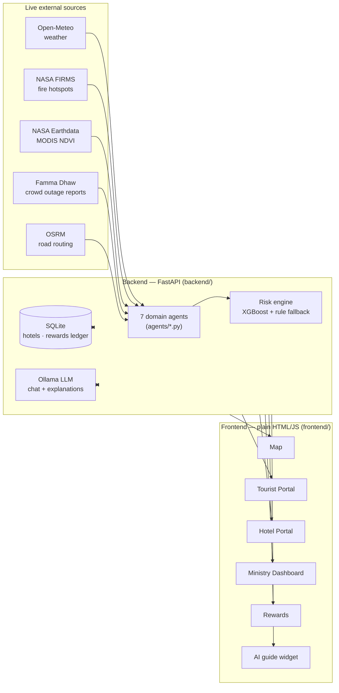
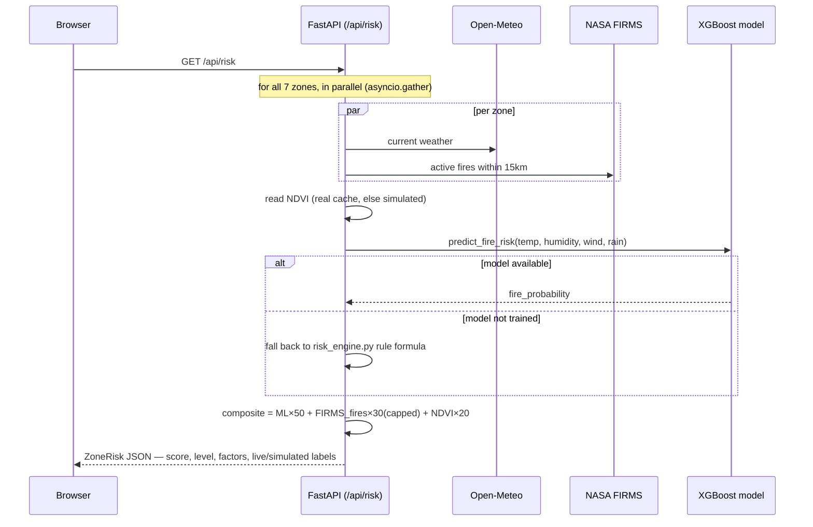
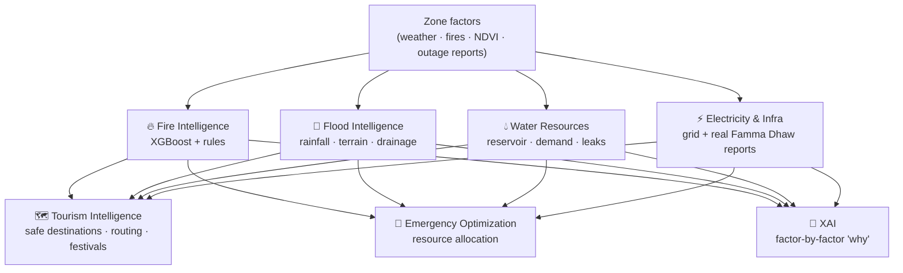
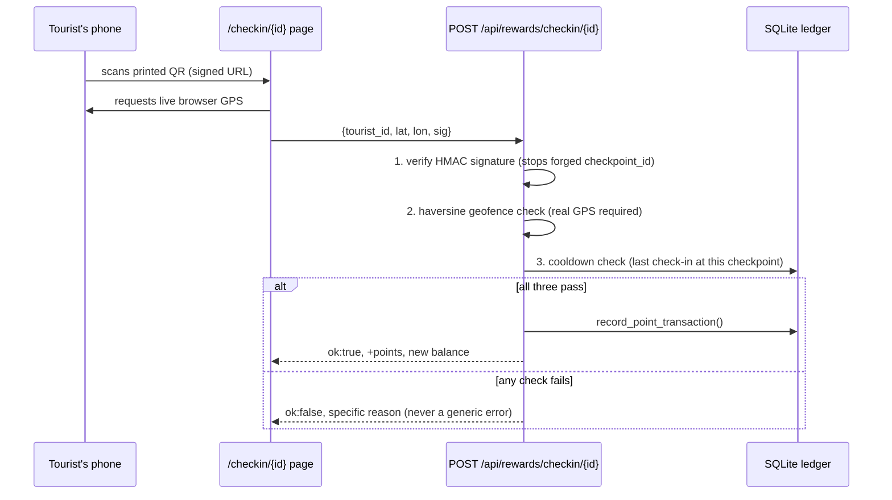
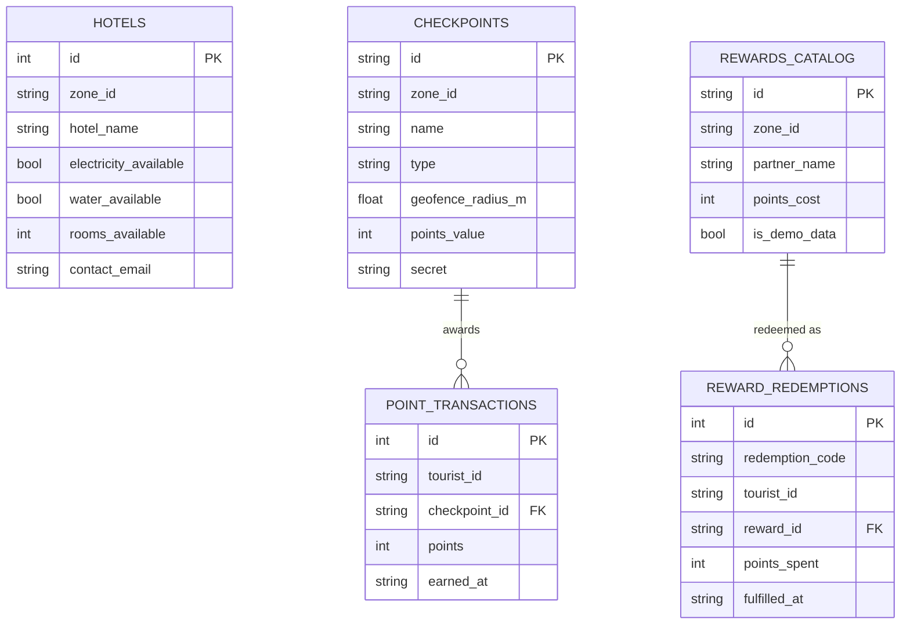

# Tunisna

Protecting People. Preserving Nature. Powering Tourism.

An AI-assisted risk platform for **7 Tunisian zones**, built around a **7-agent
system**: Fire (real ML), Flood, Water, Electricity, Tourism, Emergency, and an XAI
agent that explains every prediction factor-by-factor. Real-time weather (Open-Meteo,
no key needed), NASA FIRMS fire hotspots, real MODIS NDVI (NASA Earthdata), a real
crowd-sourced electricity outage feed (Famma Dhaw), and real OSRM road routing feed a
**trained XGBoost wildfire classifier** plus the other domain agents. A Leaflet map,
tourist screen, full multi-agent tourist portal, hotel resilience portal, Ministry
operations dashboard, an AI tourist-guide chatbot, and a QR-based rewards system
surface it all live, in **French, English, and Arabic (full RTL)**.

## Contents

0. [Architecture at a glance](#0-architecture-at-a-glance)
1. [What's new (read this first)](#1-whats-new-read-this-first)
2. [Install](#2-install)
3. [Train the wildfire model](#3-train-the-wildfire-model-required-for-real-ml-predictions)
4. [Real-time weather](#4-real-time-weather--works-out-of-the-box-no-key-needed)
5. [Real NDVI via NASA Earthdata](#5-real-ndvi-via-nasa-earthdata-optional-but-recommended)
6. [Ollama — LLM explanations & chatbot](#6-optional-ollama-for-llm-explanations--the-ai-tourist-guide)
7. [Environment variables](#7-environment-variables)
8. [Run](#8-run)
9. [Request lifecycle — how one score gets computed](#9-request-lifecycle--how-one-score-gets-computed)
10. [The 7 agents](#10-the-7-agents)
11. [The rewards system (QR check-ins)](#11-the-rewards-system-qr-check-ins)
12. [Data model](#12-data-model)
13. [Demo scenario](#13-demo-scenario)
14. [Performance](#14-performance)
15. [Forecast, dashboard, and 3-language UI](#15-forecast-dashboard-and-3-language-ui)
16. [What's real vs. simulated](#16-whats-real-vs-simulated-read-this-before-a-judge-asks)
17. [Design decisions](#17-design-decisions)
18. [Project structure](#18-project-structure)
19. [API endpoints](#19-api-endpoints)
20. [Zones reference](#20-zones-reference)

---

## 0. Architecture at a glance



No frontend framework, no ORM, no build step. `backend/main.py` is one FastAPI app
exposing ~50 routes; the frontend is 5 static HTML pages plus shared scripts
(`i18n.js`, `sidebar.js`, `chat_widget.js`) loaded on every page.

## 1. What's new (read this first)

This build grew from a single-hazard (wildfire) MVP into a 7-agent, 7-zone, 3-language
operations platform with a self-reported hotel database and a live rewards economy.
Everything below is real and independently verified, with the same honesty discipline
as the original fire-risk work — simulated data is always labeled `is_simulated: true`
(or an equivalent explicit field) and never silently presented as real.

- **Siliana added as the 7th zone**, with real coordinates and geographically-reasoned
  entries in every agent's per-zone table (same discipline as the original 6). Wired to
  an **exact** Famma Dhaw electricity slug (`siliana-ville`), real destinations (Table
  de Jugurtha, Makthar/Mactaris — sourced from Tunisia's own heritage institute), a real
  annual festival (Festival Théâtre et Société de Siliana), and two verified real hotels
  (Hôtel Le Zama, Domaine du Mouton Vert) seeded with neutral, unconfirmed operational
  defaults — never fabricated live status.
- **AI tourist-guide chatbot** (`backend/chat_agent.py`, floating widget on every page).
  Every reply is grounded in this platform's own live data (zone risk scores, hotel
  stats, static site descriptions from `data/zone_guide.json`) — never freeform LLM
  invention. If Ollama is unreachable, it says so explicitly instead of faking an answer.
- **QR-based tourist rewards** (`backend/rewards_service.py`, `/rewards`,
  `/checkin/{id}`). Scanning a checkpoint's QR code awards points only after a **signed
  URL + live GPS geofence + per-checkpoint cooldown** all pass — see
  [§11](#11-the-rewards-system-qr-check-ins). Points redeem for partner perks via a
  one-time code a hotel can verify and mark used. Every seeded reward is flagged
  `is_demo_data` since no real partner has committed to honoring it yet.
- **Arabic added, with full RTL** — not just translated strings. The sidebar
  physically moves to the other edge, borders/margins mirror, and the language toggle
  is a real 3-way cycle (FR → EN → AR → FR), centralized in `i18n.js`.
- **Zone-ID mismatch fixed** (original + newly discovered instances). The flood/water/
  electricity/emergency/XAI agents' simulated lookup tables were originally keyed to a
  10-city set that didn't match this app's zones — only 2 had real entries, the rest
  silently got generic fallback numbers. Separately, `data/tourism_resources.json` had
  its own instance of the same bug: Dougga's destination was keyed to zone_id `"beja"`
  and Hammamet's to `"nabeul"`, so those two zones showed **zero** destinations in the
  tourist portal; Bulla Regia and Ichkeul had no destination entries at all. All 7 zones
  now have at least one real destination.
- **Famma Dhaw electricity integration** (`backend/famma_dhaw_client.py`) — real,
  live, crowd-sourced outage data for Tunisia, via the same public Supabase endpoint
  their own website's frontend calls (no official API exists; this is unofficial
  community data, always labeled as such). 4 of 7 zones match exactly; the other 3 map
  to their nearest tracked municipality, explicitly flagged as an approximation.
- **Hotel Resilience Dashboard** (`/hotel-portal`) — real SQLite persistence
  (`backend/db.py`). Hotels self-report electricity/water/internet/generator/battery/
  solar/autonomy/rooms, which persists across restarts. `GET
  /api/hotels/resilience/summary` aggregates: % operational, generator/battery/solar
  coverage, most resilient zone, rooms available in currently-safe zones. `GET
  /api/hotels/alternative/{zone}/{hotel}` implements: if a hotel lacks power, recommend
  an operational alternative in the same zone, then neighboring zones.
- **Smart Tourist Route Planner** (`backend/route_planner.py`) — real road routing via
  OSRM's public API (no key). Requests OSRM's real alternative-route feature, then
  picks whichever alternative's actual road geometry passes farthest from zones
  currently at high/critical fire risk. If OSRM has no genuine alternative, that's
  reported honestly rather than inventing one.
- **Automatic hotel email notifications** (`backend/email_client.py`) — real SMTP
  sending, gated behind `SMTP_HOST`/`SMTP_USERNAME`/`SMTP_PASSWORD`. Without them
  configured, every notification is logged in full instead of silently dropped, and
  the API response says `"sent": false, "method": "log_only"` rather than claiming
  success.

## 2. Install

```bash
pip install -r requirements.txt
```

## 3. Train the wildfire model (required for real ML predictions)

```bash
python -m training.train_fire
```

This downloads nothing at runtime — it trains on the dataset already vendored at
`data/raw/Algerian_forest_fires_dataset_UPDATE.csv` — and writes
`models/wildfire_model.pkl` + `models/wildfire_model_meta.json` (metrics, feature
importances, dataset citation). **If you skip this step**, the app does not break:
every risk computation automatically falls back to the rule-based formula in
`backend/risk_engine.py`, and `/api/predict/{zone_id}` returns `"ml": null` with
`source_datasets.ml_model` explicitly saying the model isn't available — never a
silent placeholder number.

## 4. Real-time weather — works out of the box, no key needed

Weather (temperature, wind, humidity, rain) comes from
[Open-Meteo](https://open-meteo.com), which requires **no API key and no signup at
all**. This is live, real data from the moment you start the server.

## 5. Real NDVI via NASA Earthdata (optional but recommended)

NDVI (vegetation dryness) defaults to a simulated file
(`data/ndvi_simulated.json`, one entry per zone) unless you connect real satellite data:

1. Create a free account at https://urs.earthdata.nasa.gov/ (NASA Earthdata Login).
2. Set `EARTHDATA_USERNAME` and `EARTHDATA_PASSWORD` as environment variables.
3. Fetch real NDVI:
   ```bash
   python -m training.fetch_real_ndvi
   ```
   Or, with the server running, `POST /api/ndvi/refresh` (also exposed as the
   "🛰️ Refresh satellite NDVI" button on the map). Both read zones **dynamically**
   from `data/zones.json` — adding a new zone (as we did with Siliana) never
   requires touching this fetch logic, only re-running it.

**Read this before expecting instant results:** this calls NASA's AppEEARS API,
which processes MODIS satellite data as an asynchronous task — it typically takes
**several minutes**. This is not a bug: **no vegetation index from any satellite is
truly real-time.** MOD13Q1 is a 250m, **16-day composite** product with its own
processing lag on top. This build fetches the actual most-recent composite and labels
it with its real composite date, rather than pretending to have something that
doesn't exist.

If credentials aren't set, the fetch hasn't been run yet (or hasn't been re-run since
a new zone was added), or it fails, the app transparently falls back to the simulated
file per-zone — check `GET /api/ndvi/status` or `source_datasets.ndvi` in any
`/api/predict/{zone_id}` response to see exactly which one is in effect right now.
A `"6/7 real"` reading on the dashboard is not a bug — it means one zone's real
composite hasn't been fetched yet; running a refresh (with credentials configured)
closes the gap automatically.

## 6. (Optional) Ollama for LLM explanations & the AI tourist guide

Two features share this one dependency: the tourist-query explanation
(`backend/llm_agent.py`) and the AI tourist-guide chatbot (`backend/chat_agent.py`).
If Ollama isn't installed or running, both fall back automatically — the explanation
uses a deterministic template built from the real risk factors, and the chatbot
returns an explicit "guide unavailable" message in the user's language. Nothing
breaks, and nothing pretends an AI answered when it didn't.

```bash
ollama pull llama3.1:8b
ollama serve
```

## 7. Environment variables

- `EARTHDATA_USERNAME` / `EARTHDATA_PASSWORD` — free account at
  https://urs.earthdata.nasa.gov/, needed for real NDVI (§5). Without these,
  NDVI stays simulated.
- `FIRMS_API_KEY` — free MAP_KEY from https://firms.modaps.eosdis.nasa.gov/api/map_key/
  (just an email signup). Without it, active fire count defaults to 0.
- `SMTP_HOST` / `SMTP_PORT` (default 587) / `SMTP_USERNAME` / `SMTP_PASSWORD` /
  `SMTP_FROM_EMAIL` — needed for real hotel hazard-alert emails. Any standard SMTP
  provider works (Gmail app password, SendGrid, your own mail server). Without these,
  notifications are logged in full instead of sent — never silently dropped, never
  falsely reported as sent.
- Weather needs **no key** (Open-Meteo). Famma Dhaw electricity data needs **no key**
  (public endpoint). OSRM routing needs **no key** (public demo server). The QR
  rewards engine needs **no key** (`qrcode`/`Pillow` render locally). Ollama needs
  **no key** (runs entirely on your own machine).

```powershell
# Windows PowerShell
$env:EARTHDATA_USERNAME = "your_username"
$env:EARTHDATA_PASSWORD = "your_password"
$env:FIRMS_API_KEY = "your_key_here"
$env:SMTP_HOST = "smtp.gmail.com"
$env:SMTP_USERNAME = "you@gmail.com"
$env:SMTP_PASSWORD = "your_app_password"
$env:SMTP_FROM_EMAIL = "you@gmail.com"
```

## 8. Run

```bash
uvicorn backend.main:app --reload
```

| Page | URL |
|---|---|
| Risk map | http://localhost:8000/ |
| Simple tourist screen | http://localhost:8000/tourist |
| Full multi-agent tourist portal | http://localhost:8000/tourist-portal |
| Hotel resilience portal | http://localhost:8000/hotel-portal |
| Ministry operations dashboard | http://localhost:8000/dashboard |
| Tourist rewards (balance, catalog, redeem) | http://localhost:8000/rewards |
| Check-in landing page (what a QR opens) | http://localhost:8000/checkin/{checkpoint_id}?sig=... |
| Full explainability for any zone | http://localhost:8000/api/predict/dougga |
| 3-day risk forecast for any zone | http://localhost:8000/api/forecast/dougga |
| Unified multi-agent dashboard for any zone | http://localhost:8000/api/tourist/dashboard/dougga |
| NDVI data-source status | http://localhost:8000/api/ndvi/status |

## 9. Request lifecycle — how one score gets computed

Tracing what happens on `GET /api/risk` (the call every page's fire-risk display
ultimately depends on) is the fastest way to understand the whole backend:



Every other feature (tourist portal, dashboard, chatbot grounding, route planner's
hazard-avoidance) calls the same `_compute_zone_risk()` — there is one source of
truth for "how risky is this zone right now," recomputed fresh on every request
(bounded only by the 60s weather cache and 5min FIRMS cache in `backend/cache.py`).

## 10. The 7 agents



| Agent | File | Real input | Simulated input |
|---|---|---|---|
| 🔥 Fire | `backend/ml_risk.py`, `inference/predict.py` | weather, FIRMS, NDVI | — (trained model + rule fallback) |
| 🌊 Flood | `agents/flood_agent.py` | rainfall, humidity | terrain class, drainage index, historical frequency |
| 💧 Water | `agents/water_agent.py` | temperature | reservoir %, tourism demand, leak index |
| ⚡ Electricity | `agents/electricity_agent.py` | **real outage status** (Famma Dhaw) | grid reliability, solar index, backup % |
| 🗺️ Tourism | `agents/tourism_agent.py` | live scores from the other agents | destinations/festivals (`tourism_resources.json`) |
| 🚨 Emergency | `agents/emergency_agent.py` | live scores from the other agents | resource pools, response times |
| 🧠 XAI | `agents/xai_agent.py` | any agent's factors dict | historical incident notes |

## 11. The rewards system (QR check-ins)

Tourists scan a QR code posted at a real checkpoint (monument, airport, activity);
their phone's own camera app opens the link — there's no in-app scanner. Points only
land in the ledger after three independent checks pass:



The signature is intentionally **static**, not time-rotating: a real checkpoint is a
printed poster with no power or connectivity, so the code can't rotate on a timer.
Its only job is stopping someone from hand-editing a URL to claim a checkpoint_id (and
its points) they never scanned — it does **not** stop someone photographing the QR and
sharing it, because the person they share it with still has to be physically present
to pass the geofence, which is a real visit, not fraud. Redemption works the same
honesty-first way: `POST /api/rewards/redeem` returns a one-time code, and
`POST /api/rewards/redemptions/{code}/fulfill` lets a partner mark it used — a second
fulfillment attempt is explicitly rejected, not silently allowed.

## 12. Data model

The first real database in this project (`backend/db.py`, raw `sqlite3`, no ORM,
`data/app.db`). Two independent use cases share the file:



`hotels` is the only table real people write to directly (via `/hotel-portal`).
Checkpoints and the rewards catalog are seeded idempotently on every startup from
`data/checkpoints_seed.json` / `data/rewards_catalog_seed.json` — seeding checks
before inserting, so it never overwrites a real edit made after the first run, and
never rotates a checkpoint's signing secret out from under an already-printed QR.

## 13. Demo scenario

Click **"Trigger fire scenario (Aïn Draham)"** on the map to force elevated
temperature/wind/humidity/rain/active-fires and dry NDVI for Aïn Draham — its risk
score and marker color update immediately. Click **"Reset scenario"** to restore all
zones to live/real values.

## 14. Performance

`/api/risk` computes weather + fires + ML inference for all 7 zones. Optimizations,
measured on this machine:

- **Parallelized per-zone fetching** (`asyncio.gather` instead of a sequential loop).
- **Short-lived server-side cache** for weather (60s) and FIRMS (5min), since neither
  changes meaningfully faster than that — warm-cache latency drops to ~10-25ms.
- **Live updates via Server-Sent Events** (`GET /api/risk/stream`) replace
  client-side polling: the map receives a push every 5s, and multiple open
  tabs/viewers stay in sync automatically. If `EventSource` isn't available or the
  stream drops permanently, the frontend transparently falls back to plain polling —
  same "never hard-fail" pattern as every other layer of this app.

## 15. Forecast, dashboard, and 3-language UI

- **3-day risk forecast, not just current conditions.** `GET /api/forecast/{zone_id}`
  runs a real Open-Meteo daily forecast through the exact same ML composite scoring as
  the live map (`backend/risk_forecast.py`). NDVI and active-fire count are held at
  today's value for the whole window (neither is forecastable), and that limitation is
  stated in the API response itself.
- **The tourist date field is load-bearing.** Dates 1-3 days out use the real
  forecast for that specific day; today uses live data; anything further out honestly
  falls back to "no reliable forecast that far out, showing current conditions"
  (`_resolve_zone_risk_for_date` / `MAX_RELIABLE_FORECAST_DAYS` in `backend/main.py`).
- **Ministry dashboard** (`/dashboard`): all zones sorted by risk, summary stats,
  live via the same SSE stream as the map, plus printable QR codes for every reward
  checkpoint and a one-click hazard email blast to declared hotels.
- **Three languages, with real RTL for Arabic** (`frontend/i18n.js`), persisted via
  `localStorage`, covering every page's UI chrome, the tourist screen's LLM/fallback
  explanation (genuinely generated server-side in the selected language, not
  translated client-side), and the AI guide chatbot. The toggle is a real 3-way cycle
  (FR → EN → AR → FR); switching to Arabic flips `document.documentElement.dir` to
  `rtl`, which physically relocates the fixed-position sidebar and toggle button, not
  just the text direction.

## 16. What's real vs. simulated (read this before a judge asks)

| Signal | Source | Status |
|---|---|---|
| Wildfire probability | XGBoost classifier trained on the **Algerian Forest Fires Dataset** (Abid, F., Zenodo 2022, DOI [10.5281/zenodo.6515969](https://doi.org/10.5281/zenodo.6515969), CC-BY-4.0) | **Real, trained model.** 243 real historical daily records. Held-out test metrics: accuracy 0.86, ROC-AUC 0.94 (see `models/wildfire_model_meta.json`). |
| Temperature / wind / humidity / rain | Open-Meteo | **Real, live, no key needed.** Falls back to a fixed default only if the network call itself fails. |
| Active fires nearby | NASA FIRMS satellite hotspot detections (haversine-filtered) | **Real, live**, if `FIRMS_API_KEY` is set; otherwise an explicitly-flagged fallback default. |
| NDVI (vegetation dryness) | NASA Earthdata/AppEEARS, MODIS MOD13Q1.061 (real) or `data/ndvi_simulated.json` (simulated) | **Real per-zone**, if credentials are set and a refresh has been run for that zone since it was added; otherwise explicitly labeled SIMULATED. Check `/api/ndvi/status`. |
| Electricity outage status | Famma Dhaw crowd-sourced reports (Supabase) | **Real** where a zone's slug has ≥1 community report; **simulated fallback** where the slug exists but has zero reports (e.g. Siliana currently), or no slug mapping exists. `outage_source` names exactly which. |
| Road routing | OSRM public demo server | **Real** road geometry and real alternative-route selection; no fabricated straight lines. |
| LLM prose explanation & AI guide | Ollama (`llama3.1:8b`) | Real local LLM call when available; deterministic template / explicit "unavailable" fallback (built from the same real numbers) if not. |
| Flood / Water / Electricity risk *factors* (reservoir %, drainage index, grid reliability, etc.) | — | **Simulated**, per-zone, geographically reasoned, and labeled `is_simulated: true` in every response — no live feed exists for these yet. |
| Reward checkpoint coordinates | Web-sourced city/site centroids | Flagged `is_approximate_location: true` — real GPS, but not verified exact entrance coordinates. |
| Seeded reward catalog | — | Flagged `is_demo_data: true` — no real partner has confirmed honoring these offers yet. |

**Honesty limitation, stated plainly:** there is no public labeled Tunisian wildfire
dataset, so the trained model uses a real Mediterranean fire-weather dataset from
Algeria as a proxy — not literal Tunisian ground truth. It's the same feature family
(temperature/humidity/wind/rain) used operationally in Fire-Weather-Index-style
systems, which is why it transfers reasonably, but this is disclosed rather than
glossed over. `GET /api/predict/{zone_id}` always returns `source_datasets` naming
exactly where every number came from.

## 17. Design decisions

- **Every external dependency has a fallback** (Open-Meteo, FIRMS, Ollama, Famma
  Dhaw, MODIS NDVI, the ML model itself) so a dead network, a crashed Ollama process,
  or a never-trained model never crashes the demo.
- **Real NDVI is fetched asynchronously, never inline with a request.** AppEEARS
  point tasks take minutes; `training/fetch_real_ndvi.py` (or `POST /api/ndvi/refresh`,
  a background task) refreshes a cache file that live requests read from instantly.
- **Composite score, not a black box.** `/api/risk` score = ML fire probability
  (0-50 pts) + live FIRMS active-fire count (0-30 pts) + NDVI, real or simulated
  (0-20 pts). Weights are documented in `backend/ml_risk.py`, not hidden.
- **There is a real database, deliberately scoped.** `backend/db.py` (SQLite) exists
  for exactly two things that genuinely need persistence across restarts: hotel
  self-declarations and the rewards ledger. Everything else in the platform is
  computed live or cached from external APIs on purpose — adding persistence there
  would just be a staleness bug waiting to happen.
- **Anti-fraud is scoped to what a printed QR can actually support.** A static
  signature plus a live-GPS geofence plus a cooldown is not un-defeatable security —
  it's the honest ceiling for a poster with no power source, and the design docstring
  in `backend/rewards_service.py` says exactly what it does and doesn't prevent.
- **No authentication anywhere yet, by omission, not by design.** Every mutating
  endpoint (`/api/hotels/declare`, `/api/scenario/override`,
  `/api/rewards/redemptions/{code}/fulfill`, …) is currently open. Fine for a local
  demo; the first thing to add before any real deployment.

## 18. Project structure

```
data/
  raw/Algerian_forest_fires_dataset_UPDATE.csv   real dataset, MD5-verified against Zenodo
  processed/algerian_forest_fires_clean.csv       output of preprocessing/clean_fire_data.py
  zones.json                    7 zones (6 original + Siliana)
  ndvi_simulated.json           simulated NDVI baseline, one entry per zone
  ndvi_real_cache.json          real MODIS NDVI cache (generated by fetch_real_ndvi.py)
  tourism_resources.json        destinations, routes, festivals (zone-ID-correct as of this build)
  zone_guide.json                per-zone fr/en/ar descriptions, used to ground the AI chatbot
  checkpoints_seed.json          reward checkpoints (location, geofence radius, points)
  rewards_catalog_seed.json      example redeemable rewards, flagged is_demo_data
  app.db                        SQLite - hotels + rewards ledger (generated at runtime)
preprocessing/
  clean_fire_data.py    parses the messy raw CSV (two regions, header repeats, data typos)
training/
  train_fire.py         trains XGBoost, saves model + metadata + metrics
  fetch_real_ndvi.py     fetches real MODIS NDVI via NASA Earthdata/AppEEARS
models/
  wildfire_model.pkl          trained classifier (generated by training/train_fire.py)
  wildfire_model_meta.json    dataset citation, metrics, feature importances, class stats
inference/
  predict.py             loads the model once, serves predict_fire_risk()
backend/
  main.py                 FastAPI app + all routes, SSE stream, startup seeding
  cache.py                tiny TTL cache used by weather/FIRMS clients
  ml_risk.py              composite score = ML + FIRMS + NDVI, documented weights
  risk_engine.py           rule-based FALLBACK scorer (used only if the model is unavailable)
  weather_client.py        Open-Meteo wrapper (real-time, no key, with fallback)
  firms_client.py          NASA FIRMS wrapper (with fallback, haversine filtering, reports is_live)
  earthdata_client.py      NASA Earthdata/AppEEARS client (login, submit/poll/download MODIS NDVI task)
  ndvi_cache.py            shared real-NDVI cache read/write, used by the CLI script and live endpoint
  llm_agent.py             Ollama tourist-query explanation (with fallback)
  chat_agent.py             Ollama AI tourist-guide chatbot, grounded in live data (with fallback)
  scenario.py               weather/fire/NDVI factor overrides for the demo
  risk_forecast.py          3-day forecast: same ML scoring, real Open-Meteo forecast weather
  famma_dhaw_client.py      real crowd-sourced electricity outage data (Supabase, no official API)
  db.py                     SQLite persistence - hotels + rewards ledger tables
  hotel_service.py          resilience aggregation + hazard-aware alternative-hotel logic
  rewards_service.py         geofence math, HMAC signing, cooldown, redemption codes
  route_planner.py           real OSRM road routing + hazard-aware alternative-route selection
  email_client.py            real SMTP delivery for hotel notifications, log-only fallback
  models.py                  Pydantic models
  agents/
    flood_agent.py water_agent.py electricity_agent.py    domain risk agents (simulated, labeled)
    tourism_agent.py emergency_agent.py                     recommendation + resource allocation
    xai_agent.py notification_agent.py                      explainability + stakeholder alerts
frontend/
  index.html, map.js, style.css              risk map + demo scenario buttons + live ML popup + forecast strip
  tourist.html, tourist.js                    simple tourist query screen, date-aware
  tourist_portal.html, tourist_portal.js       full multi-agent portal - destinations, route planner, alerts, XAI
  hotel_portal.html, hotel_portal.js           hotel self-declaration form + live status table + redemption verifier
  dashboard.html, dashboard.js                 Ministry dashboard - agents, hotel resilience, notifications, checkpoint QR codes
  rewards.html, rewards.js                     tourist points balance, redeemable catalog, check-in history
  checkin.html, checkin.js                     landing page a checkpoint's QR opens - captures GPS, submits check-in
  chat_widget.js                                floating AI tourist-guide widget, loaded on every page
  tourist_id.js                                 anonymous client-generated tourist identity (localStorage)
  i18n.js                                       shared FR/EN/AR dictionary, 3-way toggle, RTL handling
  sidebar.js                                     shared nav injection, used by all pages
```

## 19. API endpoints

| Method | Path | Description |
|---|---|---|
| GET | `/api/zones` | Static zone metadata (7 zones) |
| GET | `/api/risk` | Composite risk score for all zones |
| GET | `/api/risk/{zone_id}` | Same, single zone |
| GET | `/api/risk/stream` | Server-Sent Events: pushes the full risk list every 5s |
| GET | `/api/predict/{zone_id}` | Full explainability: prediction, confidence, explanation, source datasets |
| GET | `/api/forecast/{zone_id}` | Real 3-day risk forecast |
| GET | `/api/agents/{flood\|water\|electricity}/{zone_id}` | Individual domain agent (simulated, labeled) |
| GET | `/api/agents/tourism/{zone_id}` | Safe destinations, smart routing hints, festivals |
| GET | `/api/agents/emergency/{zone_id}` | Resource allocation, intervention sequence |
| GET | `/api/agents/xai/{fire\|flood\|water\|electricity}/{zone_id}` | Factor-by-factor explanation |
| GET | `/api/agents/notifications/{zone_id}` | Stakeholder alerts for a zone |
| GET | `/api/agents/status` | Global agent summary across all zones |
| GET | `/api/tourist/dashboard/{zone_id}` | All 7 agents run in parallel, unified response |
| POST | `/api/tourist/query` | `{zone_id, visit_date, lang}` → safe/unsafe + LLM explanation (FR/EN/AR) + alternative zone |
| POST | `/api/chat` | AI tourist-guide chatbot, grounded in live zone/hotel data (FR/EN/AR) |
| GET | `/api/hotels/{zone_id}` | Declared hotels in a zone |
| POST | `/api/hotels/declare` | Hotel self-reports operational status (upsert) |
| DELETE | `/api/hotels/{zone_id}/{hotel_name}` | Remove a declaration |
| GET | `/api/hotels/resilience/summary` | Aggregate resilience stats across all zones |
| GET | `/api/hotels/alternative/{zone_id}/{hotel_name}` | Real hazard-aware alternative-hotel recommendation |
| POST | `/api/notifications/send/{zone_id}` | Sends (or logs) real hazard emails to declared hotels |
| GET | `/api/route/airports` | Real airport coordinates for route planning |
| GET | `/api/route/plan?origin=&destination=` | Real OSRM route + hazard-aware alternative selection |
| GET | `/api/rewards/checkpoints` | List reward checkpoints (optional `?zone_id=`), incl. signed check-in path |
| GET | `/api/rewards/checkpoints/{id}/qrcode.png` | Printable QR code image for a checkpoint |
| POST | `/api/rewards/checkin/{checkpoint_id}` | `{tourist_id, lat, lon, sig}` → signature + geofence + cooldown checked, points awarded |
| GET | `/api/rewards/balance/{tourist_id}` | Points balance, totals, recent check-ins |
| GET | `/api/rewards/catalog?zone_id=` | Redeemable rewards (flagged `is_demo_data`) |
| POST | `/api/rewards/redeem` | `{tourist_id, reward_id}` → one-time redemption code |
| POST | `/api/rewards/redemptions/{code}/fulfill` | Partner marks a code used (rejects a second attempt) |
| GET | `/api/ndvi/status` | Whether real NDVI is available per zone, composite dates, credential status |
| POST | `/api/ndvi/refresh` | Kicks off a real MODIS NDVI fetch in the background |
| POST | `/api/scenario/override` | Force weather/fire/NDVI values for a zone (demo) |
| POST | `/api/scenario/reset` | Reset all zones to live/real values |

## 20. Zones reference

| Zone | Type | Coordinates | Neighbors |
|---|---|---|---|
| `tabarka` | coastal forest | 36.9544, 8.7581 | ain_draham, bulla_regia |
| `ain_draham` | forest | 36.7756, 8.6836 | tabarka, bulla_regia |
| `bulla_regia` | archaeological | 36.5567, 8.7583 | ain_draham, dougga, siliana |
| `dougga` | archaeological | 36.4225, 9.2189 | bulla_regia, ichkeul, siliana |
| `siliana` | archaeological | 36.0819, 9.3747 | dougga, bulla_regia |
| `ichkeul` | wetland | 37.1235, 9.6548 | tabarka, hammamet |
| `hammamet` | coastal | 36.4000, 10.6167 | dougga, ichkeul |
